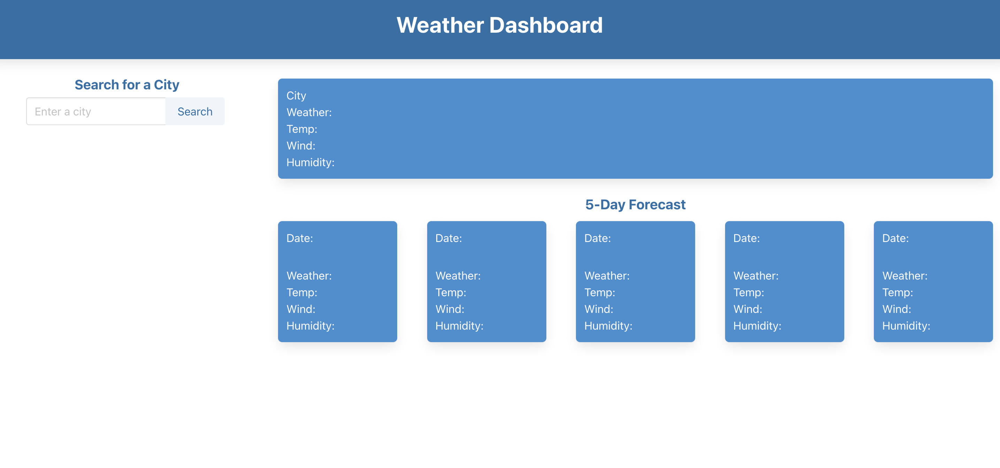
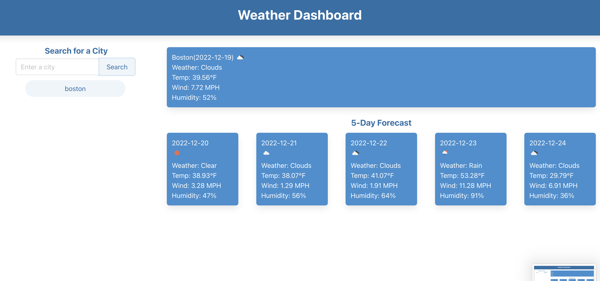
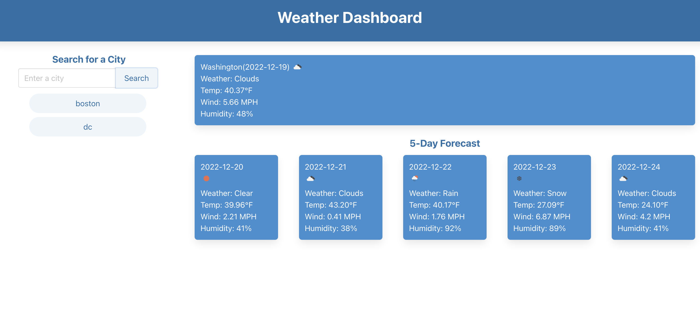
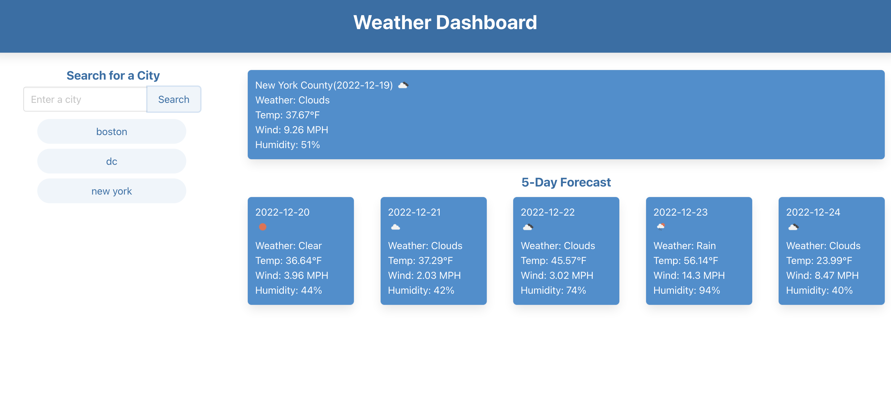
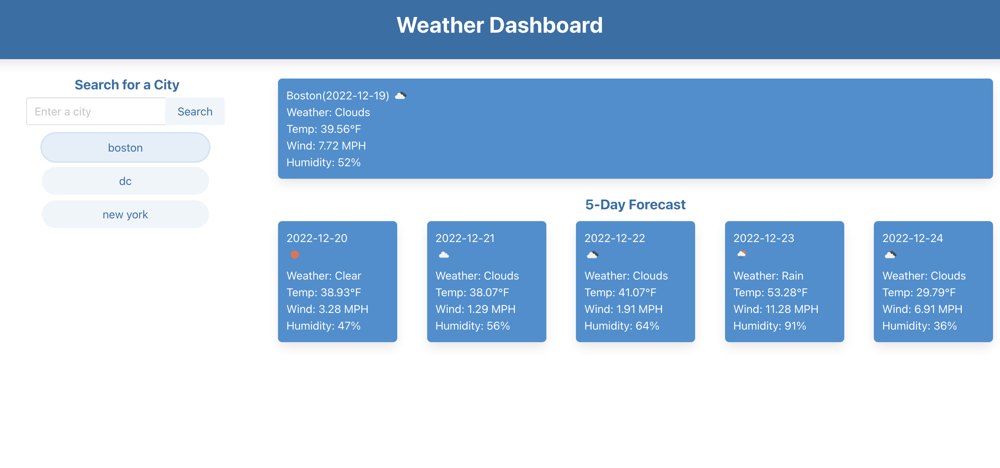

# Weather-Dashboard

## Description

This project is to create a simple interactive application that allows a user to see the weather forecast for multiple cities, so that the user can plan a trip accordingly.

## Strategies

1. The user will see the current and future conditions for a city when the user type the city name in the input box and click search button.
2. The user will see the city name, the date, an icon representation of weather conditions, the temperature, the humidity, and the wind speed on both current weather and 5-day weather forecast dashboards.
3. City names & key words will be shown as buttons under the search bar.
4. The user can click the search history buttons below the search bar and see current and future conditions for that city.
5. When refresh the page, the search history buttons will be reset. 

## Application URL

https://lzh1990214.github.io/Weather-Dashboard/

## Screenshots

Homepage displaying title, search box, and current and 5-day weather forecast dashboards:

User can type the city name in the search box:

The current and 5-day weather forecast information will be shown on dashboards after clicking the search button. The previously searched city names will be saved as a clickable buttons under search box. To limit the vertical length of the page and be user-friendly, the maximum number of saved city name buttons is set to be 8:

User can keep searching more cities and new city names will be saved in the search history:

User can keep searching more cities and new city names will be saved in the search history:

User can click one of the city name buttons in the search history to get the weather information:

